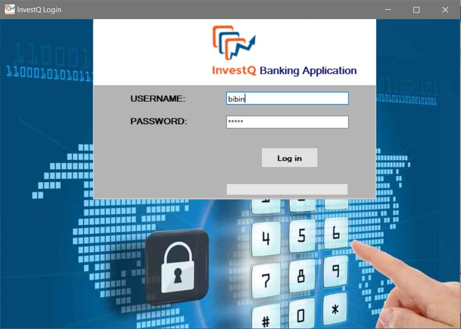
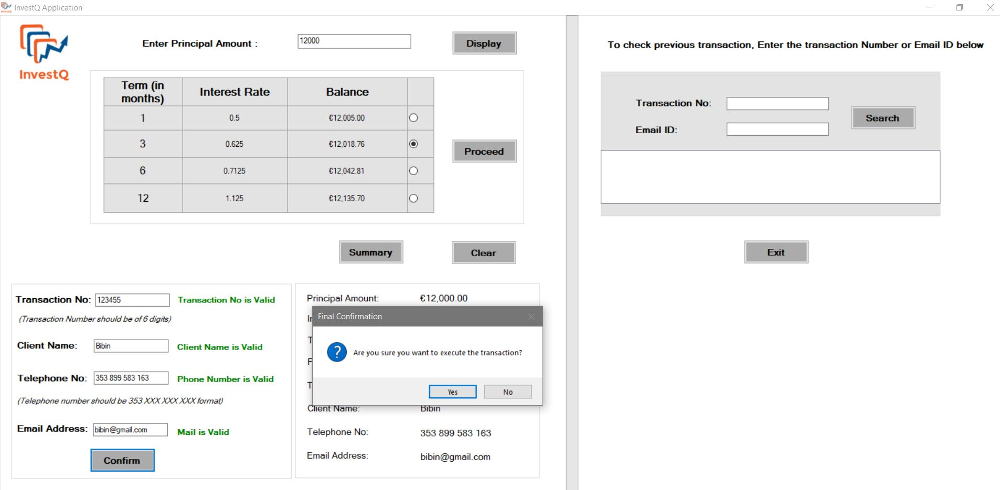

# Mini-Project-InvestQ-Bank-Application-in-Visual-Basic-C-Sharp
A Basic bank application in C# which would calculate the total interest amount for a given principal amount based on given rate of interest and term duration.

Form2.cs is the inital application file which will bring the below login file. Password is investq and username is your name.                       

Form1.cs is the main application file where logic for calculation of interest is given based on how user selects the rate of interst and time period.                                                                                                                                          

